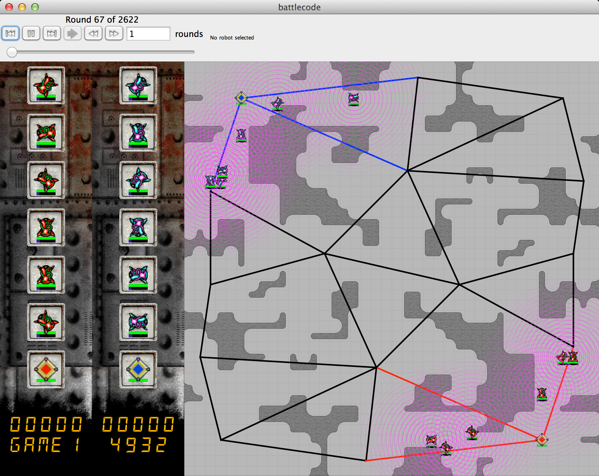

# 2012 - Archons and Nodes

* [Specs](http://bovard.github.io/bcode2012-specs/)
* [Contstants](https://github.com/battlecode/battlecode-server-2014/blob/2012-1.0.8/src/main/battlecode/common/GameConstants.java)
* [Scaffold](https://github.com/bovard/bcode2012-scaffold)
* [ZIP](https://github.com/bovard/bcode2012-scaffold/archive/master.zip)

Java Version: 1.5

### Gameplay
You start with archons capable of building units! You need to caputure way points along the map to defeat your enemies!

### Winners
* fun gamers

### Blog Posts
* [fun gamers strategy report (pdf)](https://bitbucket.org/Cixelyn/bcode2012-bot/downloads/strategyreport.pdf)

### Submissions
* [fun gamers](https://bitbucket.org/Cixelyn/bcode2012-bot)

### Source

* TODO
* TODO

### Lectures

1. [Introduction to BattleCode](http://techtv.mit.edu/collections/battlecode2012/videos/17213-6-370-battlecode-1-9-12)
2. [Range vs Melee](http://techtv.mit.edu/collections/battlecode2012/videos/17214-6-370-battlecode-1-10-12)
3. [Frameworks](http://techtv.mit.edu/collections/battlecode2012/videos/17226-6-370-battlecode-1-11-12)
5. [Swarms](http://techtv.mit.edu/collections/battlecode2012/videos/17244-6-370-battlecode-1-12-12)
6. [Github, QA and Answers](http://techtv.mit.edu/collections/battlecode2012/videos/17245-6-370-battlecode-1-13-12)
7. [Strategy](http://techtv.mit.edu/collections/battlecode2012/videos/17302-6-370-battlecode-1-17-12)
8. [Morality in the Meta Game (Guest Lecture)](http://techtv.mit.edu/collections/battlecode2012/videos/17325-6-370-battlecode-1-18-12)
9. [Sprint Tournament Analysis](http://techtv.mit.edu/collections/battlecode2012/videos/17365-6-370-battlecode-1-19-12)
10. [Diffenential Equations for Strategy](http://techtv.mit.edu/collections/battlecode2012/videos/17393-6-370-battlecode-1-20-12)