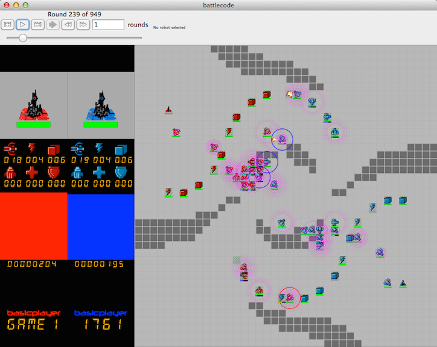

# 2013 - Mines and Nukes

* [Specs](https://github.com/bovard/battlecode-server-2014/blob/325ac6f5a9b3333f439ed3d30aec33209746e982/specs.md)
* [Contstants](https://github.com/bovard/battlecode-server-2014/blob/325ac6f5a9b3333f439ed3d30aec33209746e982/src/main/battlecode/common/GameConstants.java)
* [Scaffold](https://github.com/bovard/bcode2013-scaffold)

Java Version: 1.5

### Gameplay
You start with a base, capable of creating soldiers or researching new tech! The battlefield is littered with mines and encampment squares. The first to destroy the enemy base wins!

### Winners
* [Teh Nubs](http://tehnubs.blogspot.com/)

### Blog Posts
* [The Nubs Post Mortum](http://tehnubs.blogspot.com/)

### Submissions
* [The Nubs](https://github.com/asdfryan/battlecode2013/tree/master/teams)
* [battlecode-client-2015](https://github.com/bovard/battlecode-client-2015)
* [battlecode-server-2015](https://github.com/bovard/battlecode-server-2015)

### Lectures

1. [Introduction to BattleCode](https://www.youtube.com/watch?v=BLExWo9Empk)
2. [Writing Your First Player](https://www.youtube.com/watch?v=Fl6fKzon8LI)
3. [Navigation](https://www.youtube.com/watch?v=PA3bcu83j38)
5. [Git Repository](https://www.youtube.com/watch?v=g2NoQCEgsCM)
6. [Swarms, Artillery and Mines](https://www.youtube.com/watch?v=dEXo0QyA-Rs)
7. [Numerical Strategy](https://www.youtube.com/watch?v=tbsYFzmk_24)
8. [The Lost Lecture](https://www.youtube.com/watch?v=pISCwkvKMZ0)