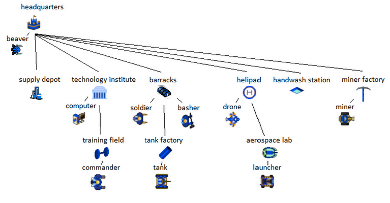

# 2015 - Launches, Tanks and Commanders

[Specs](https://github.com/bovard/battlecode-server-2015/blob/master/specs.md)

You started with a base and a generic worker called a beaver. There was a build tech tree leading up to the most powerful units, tanks and rocket launchers. In addition players could build one commander who had some incrediable powers!

Java Version: 1.7

### Gameplay
The object of the game was destroy the enemy headquarters. Each team has up to six towers on the map, and destroying these towers weakens the enemy. Due to a TechTV data loss, this video is temporarily unavailable.

### Winners
TODO

### Blog Posts

* [Battlecode 2015 (Team PCM / 147)](http://creativeascent.blogspot.com/2015/03/battlecode-2015-team-pcm-147.html)
* [deus ex machina: a postmortem](https://github.com/mackenzie-o/battlecode2015/blob/master/README.md)
* [Battlecode 2015](https://github.com/MattJohnerson/BattleCode2015/blob/master/Blogpost.pdf)
* [Battlecode_2015](http://battlecode2015millerm94.blogspot.com/2015/03/battlecode2015.html)
* [Battlecode 2015](http://battlecode2015.blogspot.com/2015/04/battlecode-2015.html)
* [Postmortum Elder Wand](http://2015team152.blogspot.com/2015/04/1-introduction-having-played-our-fair.html)

### Source
[battlecode-client-2015](https://github.com/bovard/battlecode-client-2015)
[battlecode-server-2015](https://github.com/bovard/battlecode-server-2015)

### Lectures

1. [Specs](https://www.youtube.com/watch?v=PUifzoDqN-0)
2. [Project Setup](https://www.youtube.com/watch?v=bm0H4Lqg5T4)
3. [Map Editor](https://www.youtube.com/watch?v=ITlp4-i7YGA)
4. [Player 1 - Spawn and Move](https://www.youtube.com/watch?v=Ea9ntOcrGlQ)
5. [Player 2 - Mining](https://www.youtube.com/watch?v=lkzzN3s1u7s)
6. [Player 3 - Miner Factory](https://www.youtube.com/watch?v=2YbzMFILzY8)
7. [Player 4 - Towers Shooting](https://www.youtube.com/watch?v=uIue0jXpdZQ)
8. [Player 5 - Barracks and Soldiers](https://www.youtube.com/watch?v=T4lxIij0UtE)
9. [Simple Robot Template](https://www.youtube.com/watch?v=he7NT3_iuBo)
10. [Building a Swarm Bot - Part 1](https://www.youtube.com/watch?v=paf6c-H35tc)
11. [Bulding a Swarm Bot - Part 2](https://www.youtube.com/watch?v=xXvH3Vc0LvU)
12. [Version Control Introduction](https://www.youtube.com/watch?v=ozRSVWfnWI8)
13. [Map Analysis - Terrain](https://www.youtube.com/watch?v=3jQY_-kEZEE)
14. [Map Analysis - Towers](https://www.youtube.com/watch?v=Pb20buJaoWc)
15. [Map Analysis - Putting it all together](https://www.youtube.com/watch?v=4kCKkzyE6hg)
16. [Robot Comparison](https://www.youtube.com/watch?v=yUWAiKSN3VY)
17. [Kiting Micro](https://www.youtube.com/watch?v=9kaYgaqkRkg)
18. [Are Miners Necessary?](https://www.youtube.com/watch?v=63zMQnhi7UM)
19. [Pathing Around Obstacles](https://www.youtube.com/watch?v=pqjWjVPRGeI)
